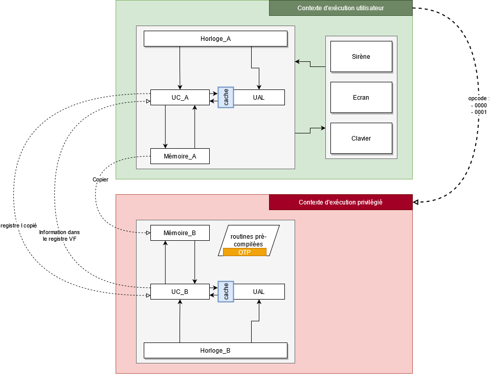

# FCSC 2021 Battle Chip

Nous avons mis en place un émulateur CHIP-8 en ligne légèrement modifié. La documentation est disponible en pièce jointe.

Votre objectif est de trouver et d'exploiter la vulnérabilité de cette architecture vous permettant de découvrir le secret généré.

La documentation associée à l'épreuve est disponible [sur cette page](https://hackropole.fr/fr/doc/battle-chip/).

**Note :** le flag est de la forme <code>FCSC{secret.hex().lower()}</code>.

Fichiers :
- [VM.png](VM.png)
- [emulator.zip](emulator.zip)

Auteur : sheidan

Origine : [Battle Chip](https://hackropole.fr/fr/challenges/misc/fcsc2021-misc-battle-chip/)

-----------
### Contexte
L'entreprise Chip&Fish a mis au point une nouvelle architecture sécurisée baptisée BattleChip. Elle a implémentée une machine virtuelle légère de type CHIP-8 ainsi qu'un élément sécurisé.

L'élément sécurisé permet de chiffrer un message de taille 10 avec une clé de session. Il est également possible de demander à l'élément sécurisé de vérifier si une clé K est la clé de session courante.

L'entreprise Chip&Fish vous demande donc de tester la robustesse de leur architecture. Vous devez trouver une attaque permettant de récupérer la clé de la session courante.

Pour pouvoir intéragir avec ce nouveau composant, BattleChip implémente le code d'opération 0000 et 0001 pour intéragir avec la fonction de chiffrement et la fonction de vérification.

Le code assembleur de ces deux fonctions est fournis avec le projet.

Le constructeur a également ajouté le code d'opération FFFF qui permet d'arrêter l'exécution du CPU proprement.

Ci-après, un schéma de l'architecture mise en place.

Schéma de fonctionnement du produit

Le constructeur a également laissé quelques notes sur les périphériques :
<code>

    --- Clavier ---

    Pas de clavier, pas de pong. Pas de pong... pas de pong.
    Utiliser un code d'opération nécessitant une intéraction terminera l'execution du programme par une erreur.

    --- Horloge ---

    Rien à déclarer capitaine.

    --- Sirène ---

    _Ding dong_

    --- Ecran ---

    L'écran envoie des caractères ANSI pour contrôler l'affichage.
    Il est recommandé d'avoir une console de taille 64x32 ou
    supérieure. La VM ne renvoie pas d'informations spécifique
    sauf s'il y a une erreur lors de l'exécution.
    Faites donc bonne usage de l'écran.
</code>
Pour les utilisateurs sous Windows, ci-après un exemple de code pour activer le support des caractères ANSI :

### Windows user ONLY
<code>

    import os
    import ctypes

    def activate_vti():
        """Enable Virtual Terminal Input

        Documentation: https://docs.microsoft.com/en-us/windows/console/setconsolemode
        """
        if os.name == "nt":
            kernel32 = ctypes.windll.kernel32
            hStdout = kernel32.GetStdHandle(-11)
            result = kernel32.SetConsoleMode(hStdout, 0x1 | 0x2 | 0x4)
            if result == 0:
                raise RuntimeError("Console doesn't support ANSI character")
</code>

-----------

## Installation manuel
Vous n'utilisez pas l'application **les CTFs de Cyrhades** ? C'est dommage !
Mais voici comment installer ce CTF manuellement :

> git clone https://github.com/Hack-Oeil/fcsc2021-misc-battle-chip.git

> cd fcsc2021-misc-battle-chip

-----------

## Sur le site officiel hackropole.fr
> https://hackropole.fr/fr/challenges/misc/fcsc2021-misc-battle-chip/